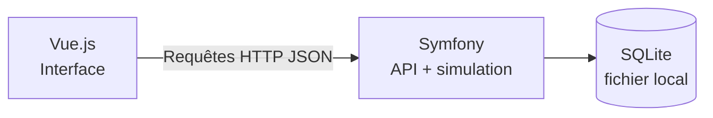

# e-Santé Robotik — version débutant

Plateforme simple de supervision de robots de préparation de doses.

Le projet utilise seulement :

- **Symfony** pour l’API, les règles métier, la simulation et SQLite ;
- **Vue.js** pour l’interface utilisateur.

## Fonctionnement



Toutes les cinq secondes :

1. Vue demande à Symfony de générer une nouvelle mesure ;
2. Symfony simule batterie, température, vitesse et charge ;
3. Symfony enregistre les mesures dans SQLite ;
4. Vue recharge les robots, alertes et interventions.

Il n’y a plus de microservice, de serveur temps réel ou de serveur PostgreSQL.

## Organisation

```text
Projet/
├── backend/                  Symfony
│   ├── src/Controller/Api/   Routes de l’API
│   ├── src/Entity/           Tables représentées en objets PHP
│   ├── src/Service/          Logique métier et simulation
│   └── var/robotik.db        Base SQLite créée automatiquement
├── frontend/                 Vue.js
│   └── src/
│       ├── components/       Écrans et composants
│       ├── services/api.ts   Appels vers Symfony
│       └── App.vue           Dashboard principal
└── docker-compose.yml        Lance Symfony et Vue
```

### Fichiers importants

- `backend/src/Service/RobotSimulator.php` génère les mesures.
- `backend/src/Service/TelemetryService.php` enregistre les mesures et détecte les alertes.
- `backend/src/Controller/Api/RobotController.php` gère les robots.
- `backend/src/Controller/Api/AlertController.php` gère les alertes.
- `backend/src/Controller/Api/MaintenanceController.php` gère les interventions.
- `frontend/src/App.vue` contient le dashboard.
- `frontend/src/services/api.ts` centralise les appels HTTP.

## Lancement avec Docker

```bash
cp .env.example .env
docker compose up --build
```

Ouvrir ensuite :

- application : <http://localhost:5173>
- test de l’API : <http://localhost:8000/api/test>

Pour arrêter :

```bash
docker compose down
```

Pour supprimer la base et repartir de zéro :

```bash
docker compose down -v
```

## Lancement sans Docker

Prérequis : PHP avec SQLite, Composer et Node.js.

Terminal 1 :

```bash
cd backend
composer install
php bin/console doctrine:schema:update --force
php bin/console app:seed
php -S localhost:8000 -t public public/index.php
```

Terminal 2 :

```bash
cd frontend
npm install
npm run dev
```

## API principale

| Méthode | Route | Fonction |
|---|---|---|
| `GET` | `/api/robots` | Liste des robots |
| `GET` | `/api/robots/{id}` | Détail d’un robot |
| `GET` | `/api/robots/{id}/telemetry` | Historique des mesures |
| `GET` | `/api/robots/{id}/timeline` | Chronologie |
| `POST` | `/api/simulation/tick` | Génère les nouvelles mesures |
| `GET` | `/api/alerts` | Liste des alertes |
| `PATCH` | `/api/alerts/{id}/acknowledge` | Prend en charge une alerte |
| `PATCH` | `/api/alerts/{id}/resolve` | Résout une alerte |
| `GET/POST` | `/api/maintenance-tickets` | Liste ou crée une intervention |

## Base SQLite

SQLite stocke toute la base dans un seul fichier :

```text
backend/var/robotik.db
```

C’est idéal pour apprendre : aucun serveur de base de données n’est nécessaire. Pour un vrai déploiement avec beaucoup de robots, PostgreSQL serait plus adapté.
